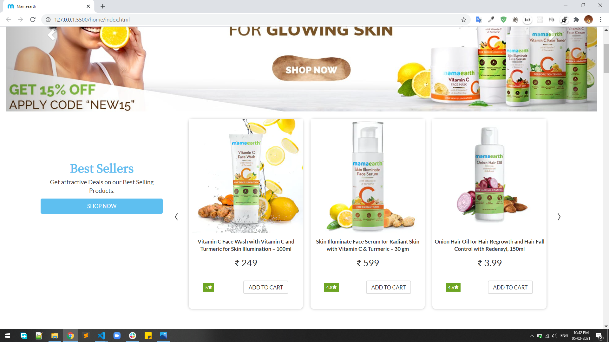
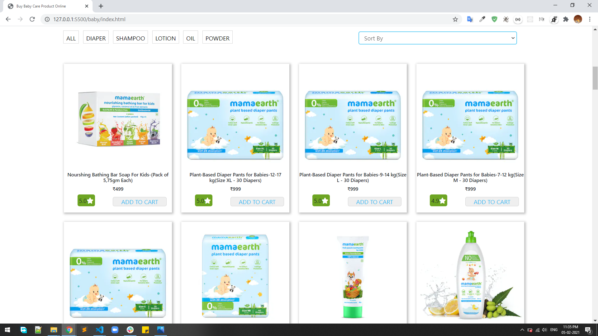
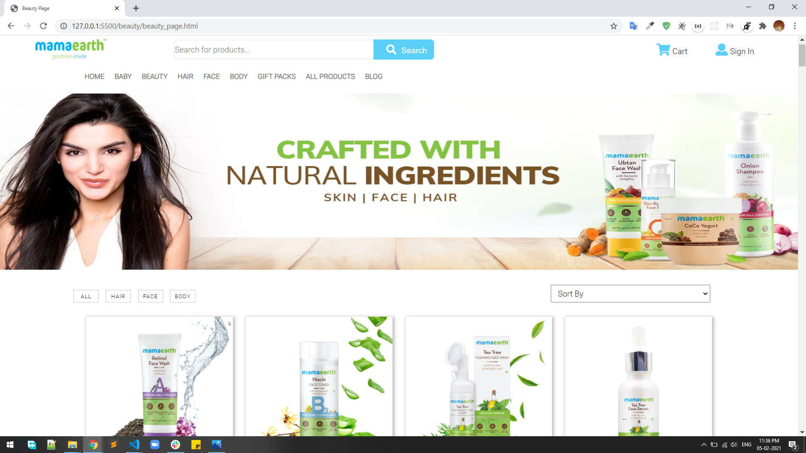
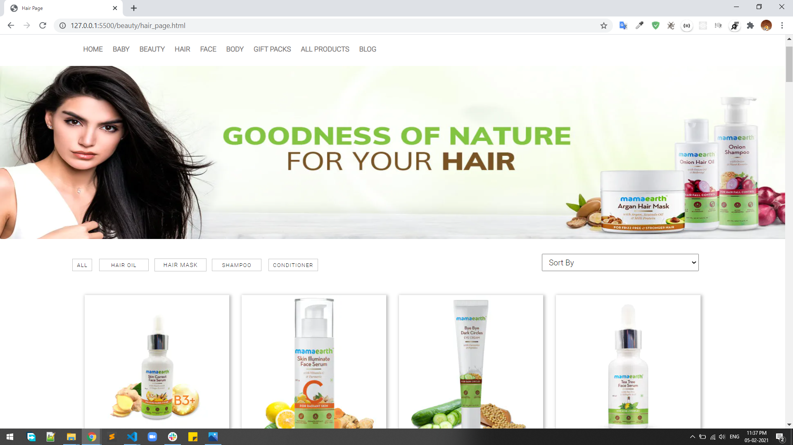
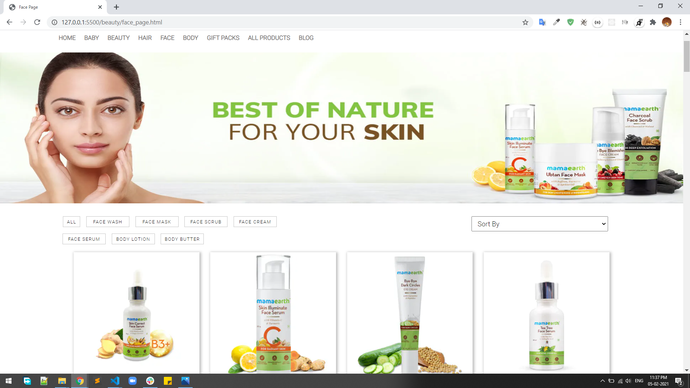
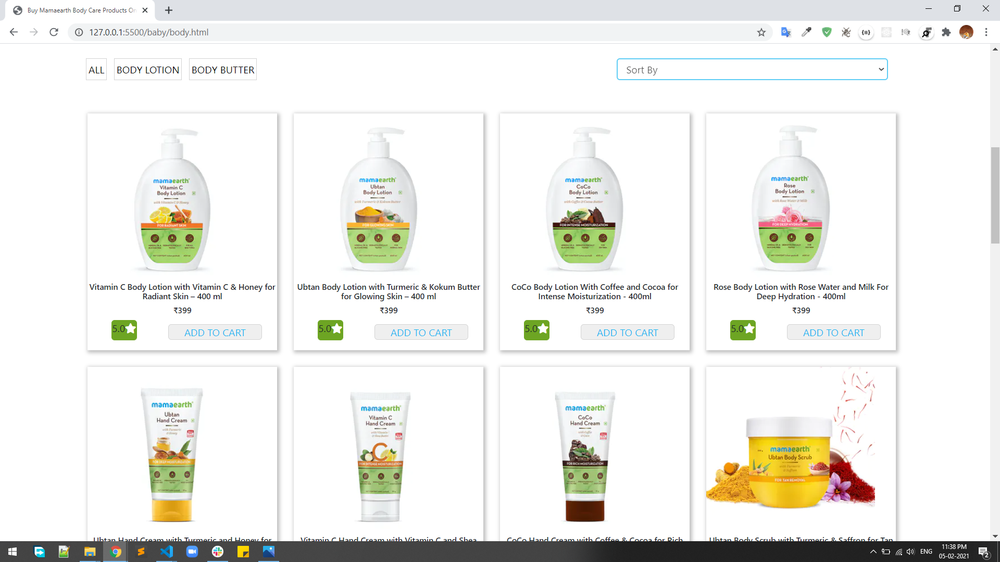
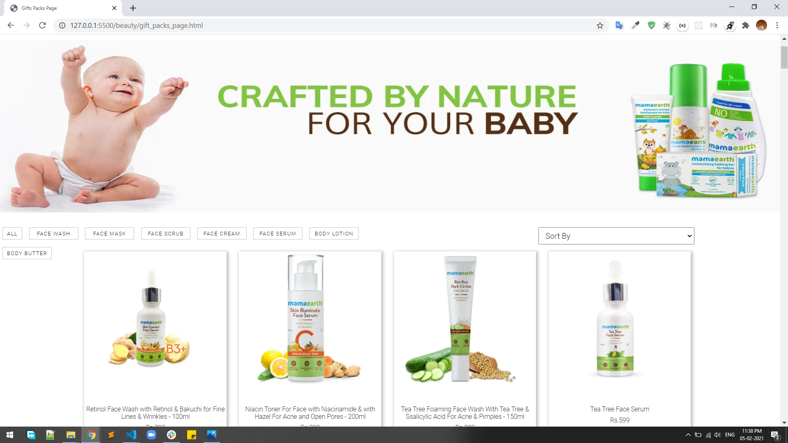
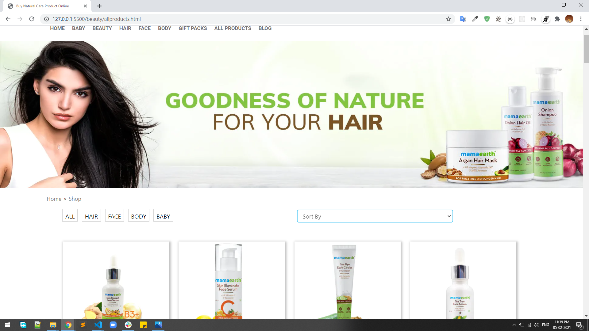
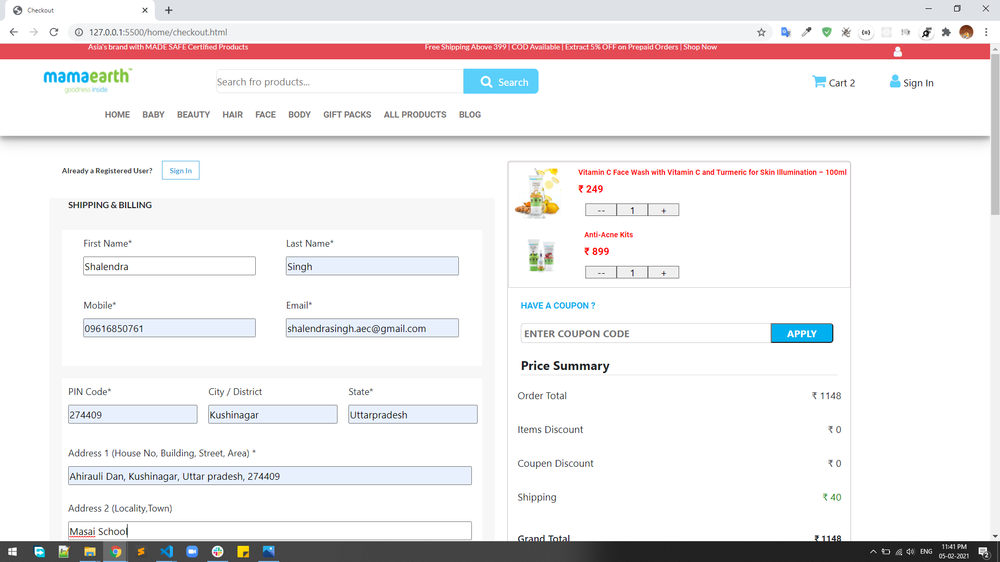
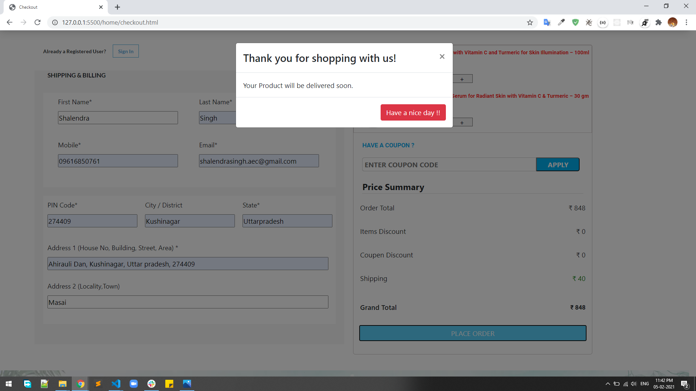

# Team_nitrogen

## Project Title : MAMA EARTH CLONE  

#### Mamaearth Natural & Toxin Free Skin Care Products Online. Only Toxin Free Madesafe Certified Brand In India.  

## <b>Getting Started with --</b> </b> 

## We are using this tools and technology to clone the website.</b> </b> 

# Technologies

<ol>
<li> HTML</li>
<li> CSS</li>
<li> JAVASCRIPT</li>
</ol>

# Tools

<ol>
<li> VS CODE</li>
<li> GIT</li>
<li> GITHUB</li>
<li> MOCK SERVER API's</li>
<li> HEROKU FOR MOCK SERVER API's DATA STORE</li>
</ol>

# Tools for communications

<ol>
<li> SLACK</li>
<li> ZOOM</li>
</ol>

### Before starting the cloning of original website firstly, we tried to understand the features and functionality of the website then we proceed to cloning the website.  

#### we start from the Home Page where all the products are listed and many categories of products are available for shopping  

<!-- **\*\***Taking one at a time\***\*\*\*\*\*** -->

<i><b>1. Click on <i>"MAMA EARTH"</i> button from the upper bar</b></i>  

 

<ul>
<li>It show all the listed categories of products. </li>    
<li>All the options on the left side are not active. you can route to any pages through these buttons.This functionality are made in javascript.  
  <ul>
    These are the pages which is linked in the Header section as Menus :  
      <li>
        <b>Best Sellers</b> : On Clicking over it, you route to the another page like baby. 
        <i>Note: All the best Sellers products is avilable.</i>
     </li> 
<li> In this page you can also search the products in search bar like - baby, diaper, powder, oil.</li> 

<li>You can purchase the items on clicking the <b>ADD TO CART</b> button.</li> 

<li>After clicking on  the add to cart button that product are goes to the cart.</li> 

  </ul>
</li>
<li> That's all about "HOME page" moving on to the next one...</li>

</ul>
  

  
<i><b>2. Click on <i>"BABY"</i> button in the upper Menu</b></i>

<ul>
<li>
        <b>BABY</b>: In this page all the products are showing which is related to the baby.  
        <i>You can filter accordingly your need like Diaper, powder, soap, etc. </i>
      </li>  
<li> That's all about "BABY" moving on to the next one...</li>
</ul>
  

  
<i><b>3. Click on <i>"BEAUTY"</i> button from the upper bar</b></i>

<ul>
<li>
        <b>BEAUTY</b>: In this page all the products are showing which is related to the baby. 
        <i>You can filter accordingly your need like Diaper, powder, soap, etc. </i>
      </li>  
<li> That's all about "BEAUTY" now moving on to the next one...</li>
</ul>
  

  
<i><b>4. Click on <i>"HAIR"</i> button from the upper bar</b></i>

<ul>
<li>
        <b>HAIR</b>: In this page all the products are showing which is related to the HAIR like Hair colour, etc. 
        <i>You can filter accordingly your need like Hair colour, sampoo, soap, etc. </i>
      </li>  
<li> That's all about "HAIR" now moving on to the next one...</li>
</ul>
  

<i><b>5. Click on <i>"FACE"</i> button from the upper bar</b></i>

<ul>
<li>
        <b>FACE</b>: In this page all the products are showing which is related to the FACE like cream, powder, etc. 
        <i>You can filter accordingly your need like cream, powder, soap, etc. </i>
      </li>  
<li> That's all about "FACE" now moving on to the next one...</li>
</ul>
  

<i><b>6. Click on <i>"BODY"</i> button from the upper bar</b></i>

<ul>
<li>
        <b>BODY</b>: In this page all the products are showing which is related to the Body like Lotion, oil, etc. 
        <i>You can filter accordingly your need like Lotion, soap, etc. </i>
      </li>  
<li> That's all about "BODY" now moving on to the next one...</li>
</ul>
  

<i><b>7. Click on <i>"GIFT PACK"</i> button from the upper bar</b></i>

<ul>
<li>
        <b>GIFT PACK</b>: In this page all the products are showing which is Specially for gifts to set of items. 
        <i>You can filter accordingly your need. </i>
      </li>  
<li> That's all about "GIFT PACK" now moving on to the next one...</li>
</ul>
  

<i><b>8. Click on <i>"ALL PRODUCTS"</i> button from the upper bar</b></i>

<ul>
 <li>
        <b>ALL PRODUCTS</b>: In this page all the products are showing. 
        <i>You can filter accordingly your need. </i>
      </li>  
<li> That's all about "ALL PRODUCTS" now moving on to the next one...</li>
</ul>
  

 
<i><b>Cart checkout page for place the order of products.</b></i>  

<ul> 
        <li>From cart page you can fill the details of the Customer and placed the order</li> 
        <li>After placed the it show some message</li>  
<li> That's all about "ALL PRODUCTS" now moving on to the next one...</li>
</ul>
  

<!-- 

  Blog Link:  <b>?</b>

 -->

<h1></h1>

 👤 Shalendra Singh
 <ul>
 <li>Github : shalendrasingh
 <li>Email : shalendrasingh.aec@gmail.com
 </ul>
<h1></h1>
 👤 Rajat Sahu 
 <ul>
 <li>Github : rajatsahu18
 <li>Email : (sahurajat78@gmail.com)
 </ul>

 
<h1></h1>

<h1></h1>

 👤 Sohail shaik
 <ul>
 <li>Github : sohailshaik8328
 <li>Email : (sohailshaik765@gmail.com)
 </ul>

<h1></h1>

👤 Ankur 
 <ul>
 <li>Github : ankurpoplu
 <li>Email : (ankurp31031@gmail.com)
 </ul>

 <h1></h1>
## Thank u for giving it a read................
